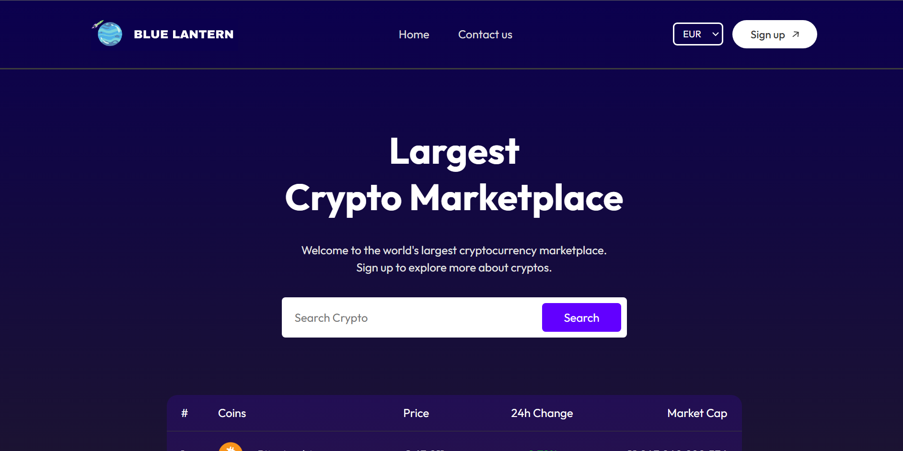
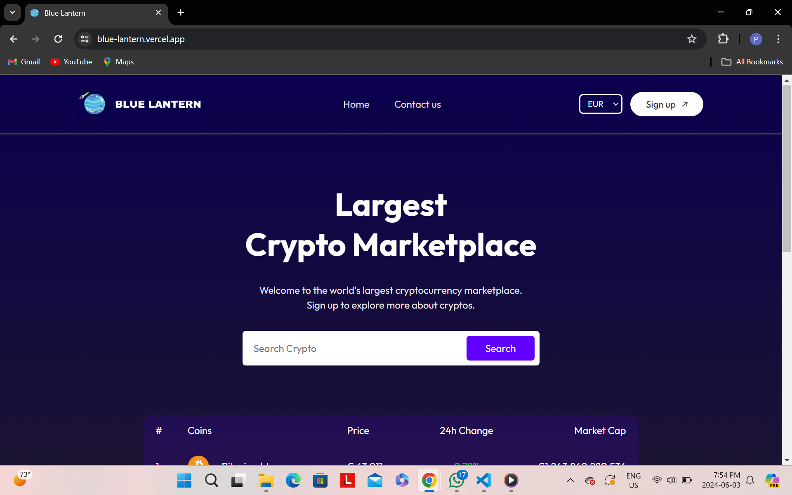
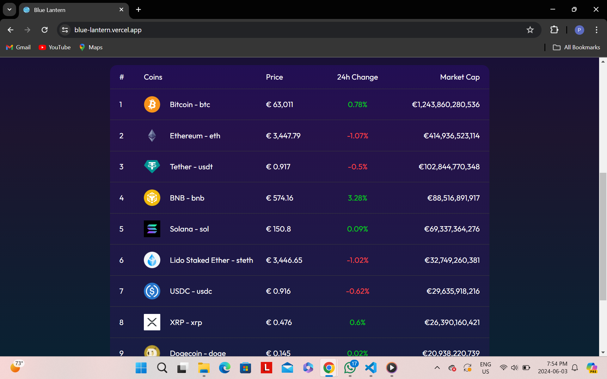
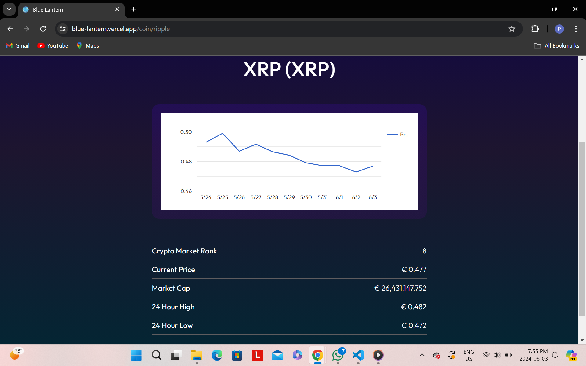
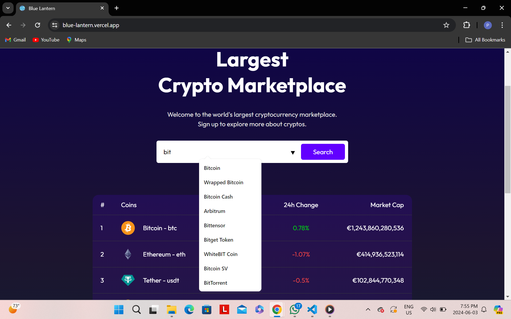
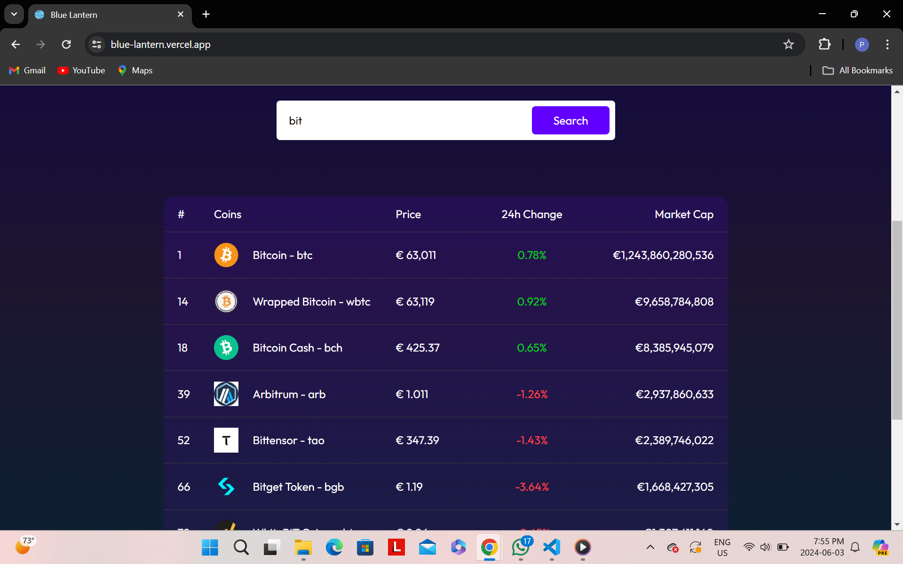
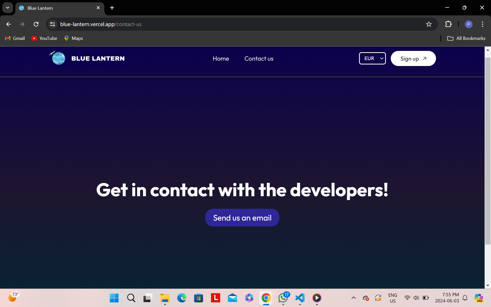

# Blue Lantern

## Table of Contents

- [Introduction](#introduction)
- [Features](#features)
- [Technology Stack](#technology-stack)
- [Usage](#usage)
- [Screenshots](#screenshots)
- [Contributing](#contributing)

## Introduction

Welcome to Blue Lantern! This is a React web application that provides real-time cryptocurrency prices and market insights. The application allows users to search and analyse for over 200+ coins, view market analysis, and get detailed information including 24h change, market cap, 24h high, and 24h low. You can choose to view prices in CAD, USD, and EUR. There's also a contact page to reach out with any questions or difficulties.

## Features

- Real-time cryptocurrency prices and market data.
- Search functionality for over 200+ cryptocurrencies.
- Market analysis with various metrics.
- Prices displayed in CAD, USD, and EUR.
- Contact page for user inquiries.

## Technology Stack

- **React**: Frontend framework for building the user interface.
- **JavaScript**: Writing the functionality and application code.
- **HTML/CSS**: Structure and styling of the application.
- **CoinGecko API**: Service used to fetch cryptocurrency data.
- **Vercel**: Deployment of the app.

## Usage

1. Open the application in your browser by clicking [here](https://blue-lantern.vercel.app/).
2. Use the search bar to find information on a specific cryptocurrency.
3. View detailed market analysis and price data.

## Screenshots

Here are some screenshots of the application in action :

### Video play

https://github.com/pharpala/Blue-Lantern/assets/128100428/085b573f-3483-45df-8335-db9b54905389

### Home Screen

### Market Cap Table

### Coin Data

### Search function

### Contact

## Contributing

Contributions are welcome! Please open an issue or submit a pull request for any improvements or bug fixes. For major changes, please open an issue first to discuss what you would like to change.
